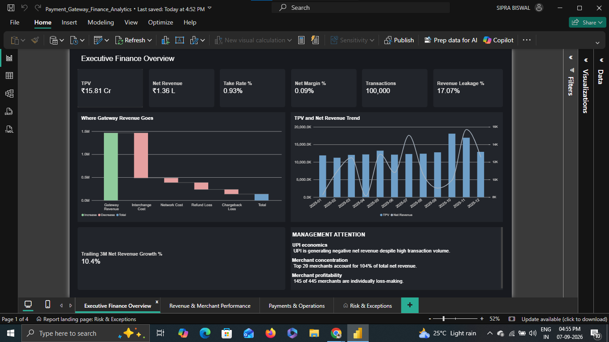
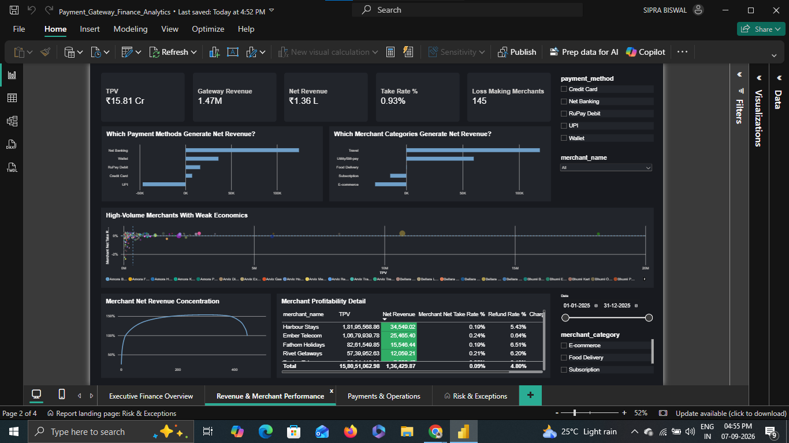
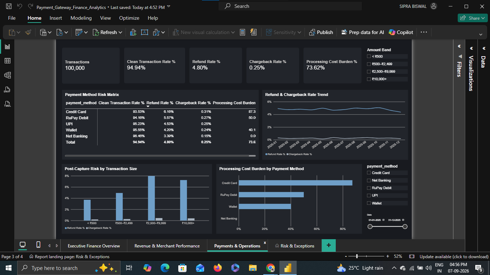
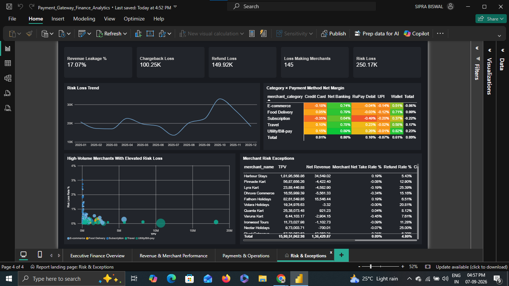

# Payment Gateway Finance & Unit Economics Analysis

### End-to-End Finance Data Analytics Project | SQL • Python • Power BI

> A finance-focused analysis of payment gateway transaction economics, revenue drivers, processing costs, merchant profitability, payment-method performance, and post-transaction risk.

---

## 📌 Overview

Payment gateways process large transaction volumes, but **high transaction volume does not necessarily translate into strong profitability**.

This project analyzes **100,000 payment transactions across 445 merchants from January–December 2025** to understand how transaction volume translates into gateway revenue and, ultimately, net revenue after processing costs, refunds, and chargebacks.

The project combines:

- 🐍 **Python** — data preparation, validation, and exploratory analysis
- 🗄️ **SQL** — financial analysis, segmentation, and scenario modeling
- 📊 **Power BI** — interactive financial reporting and business dashboards

The analysis is designed around the questions a **Finance Manager, FP&A analyst, Payments Strategy team, or Operations team** would ask.

### Key Business Questions

- How much transaction volume is being processed?
- How effectively is that volume being monetized?
- Which payment methods create or destroy value?
- Where does gateway revenue go before becoming net revenue?
- Which merchants are profitable or loss-making?
- How concentrated is the revenue base?
- Where are refunds and chargebacks creating financial risk?
- Does transaction size influence post-transaction risk?
- What happens to net revenue if transaction volume shifts between payment methods?
- Are changes in take rate driven by pricing or transaction mix?

---

## 📊 Dashboard Preview

### Executive Finance Overview


### Revenue & Merchant Performance


### Payments & Operations


### Risk & Exceptions


## 🎯 Business Objective

The core objective is to evaluate the **financial health and unit economics of the payment gateway**.

The analysis focuses on four interconnected areas:

### 1. Revenue & Monetization

Understanding:

- TPV
- Gateway revenue
- Take rate
- Net revenue
- Net margin

### 2. Cost & Revenue Leakage

Breaking down the movement from gross gateway revenue to net revenue through:

- Interchange costs
- Network costs
- Refund losses
- Chargeback losses

### 3. Merchant & Payment-Method Economics

Identifying:

- Profitable segments
- Loss-making segments
- High-volume merchants
- Underperforming merchants
- Payment-method economics

### 4. Payment Risk & Operations

Understanding:

- Refund behavior
- Chargeback behavior
- Risk concentration
- Transaction-size risk

---

## 🧰 Tech Stack

| Tool | Purpose |
|---|---|
| **Python** | Data cleaning, validation, EDA, statistical analysis |
| **Pandas** | Data manipulation and aggregation |
| **NumPy** | Numerical analysis |
| **SQL** | Financial analysis, segmentation, KPIs, scenario analysis |
| **Power BI** | Interactive dashboard and executive reporting |
| **Matplotlib / Seaborn** | Exploratory data visualization |
| **GitHub** | Version control and project documentation |

---

## 📊 Dataset

| Attribute | Details |
|---|---|
| **Transactions** | 100,000 |
| **Merchants** | 445 |
| **Period** | January 1 – December 31, 2025 |
| **Granularity** | Transaction-level |

The dataset contains fields covering:

- Transaction information
- Transaction amount
- Payment method
- Merchant
- Merchant category
- Transaction status
- Gateway revenue
- Interchange cost
- Network cost
- Refund loss
- Chargeback loss
- Net revenue

### Transaction Status

The `status` field contains:

- `Success`
- `Refunded`
- `Charged-back`

### Data Scope

The dataset represents **captured transactions**.

There is **no authorization-decline data**, so this project does not attempt to measure checkout authorization failure or true payment decline rate.

There is also **no customer identifier**, so the analysis focuses on **merchant and transaction economics**, rather than customer-level behavior, retention, or lifetime value.

These are deliberate analytical scope boundaries rather than assumptions about unavailable data.

---

# 🔍 Analytical Workflow

```text
Raw Transaction Data
        │
        ▼
Data Validation & Cleaning
        │
        ▼
Exploratory Data Analysis
        │
        ▼
SQL Financial Analysis
        │
        ▼
Unit Economics & Risk Analysis
        │
        ▼
Scenario / Sensitivity Analysis
        │
        ▼
Power BI Data Model
        │
        ▼
Executive Dashboard
        │
        ▼
Business Recommendations
```

---

# 🐍 Python — Data Preparation & EDA

Python was used as the first analytical layer to understand the dataset before performing deeper SQL analysis.

### Data Quality Checks

The analysis included:

- Dataset shape and structure
- Data types
- Missing-value analysis
- Duplicate transaction checks
- Unique transaction ID validation
- Categorical value distributions
- Numerical summary statistics
- Correlation analysis
- Outlier investigation
- Transaction amount distribution

### Exploratory Analysis

EDA was used to investigate:

- Transaction volume
- TPV distribution
- Payment-method mix
- Merchant-category mix
- Revenue distribution
- Refund and chargeback behavior
- Transaction-size distribution
- Monthly transaction trends
- Merchant-level economics

The EDA was primarily used to **discover patterns and validate assumptions**, while the final business analysis was structured around SQL and Power BI.

---

# 🗄️ SQL — Finance & Business Analysis

SQL forms the core analytical layer of the project.

The analysis goes beyond basic `GROUP BY` reporting and uses SQL to build financial metrics, segment performance, identify risk, and model business scenarios.

## Revenue & Monetization

Key metrics include:

- TPV
- Transaction count
- Gateway revenue
- Net revenue
- Take rate
- Net margin
- Revenue per transaction
- Revenue retention after costs and losses

## Payment-Method Economics

Payment methods are compared using:

- Transaction volume
- TPV
- Gateway revenue
- Processing costs
- Refund losses
- Chargeback losses
- Net revenue
- Take rate
- Net margin
- Risk-adjusted economics

## Merchant Economics

Merchant-level analysis identifies:

- Top and bottom merchants
- Loss-making merchants
- High-volume but low-margin merchants
- Merchant profitability
- Merchant concentration
- Revenue contribution by merchant rank

## Risk Analysis

The project analyzes:

- Refund rate
- Chargeback rate
- Refund losses
- Chargeback losses
- Risk by payment method
- Risk by transaction-size band
- Relationship between risk and net revenue

## Time-Series Analysis

Monthly analysis evaluates:

- Transaction growth
- TPV trends
- Net revenue trends
- Payment-method mix
- Revenue trends
- Seasonal patterns

## Advanced Financial Analysis

The SQL layer also includes:

- **Price vs. mix take-rate decomposition**
- **Payment-method volume-shift scenario analysis**
- **Risk-based pricing analysis**
- Merchant concentration analysis
- High-volume / underperforming merchant identification

---

# 💰 Unit Economics

A central part of the project is understanding how **processed transaction value becomes net revenue**.

```text
Transaction Volume (TPV)
          │
          ▼
   Gateway Revenue
          │
          ▼
   ┌──────┴──────┐
   │             │
   ▼             ▼
Processing    Risk Losses
Costs         ┌──────────────┐
              │ Refunds      │
              │ Chargebacks  │
              └──────────────┘
   │             │
   └──────┬──────┘
          ▼
     Net Revenue
```

### Core Metrics

**TPV**

> Total Payment Volume processed through the gateway.

**Take Rate**

> Gateway Revenue ÷ TPV

**Revenue Leakage Rate**

> (Refund Loss + Chargeback Loss) ÷ Gateway Revenue

**Net Margin on Gateway Revenue**

> Net Revenue ÷ Gateway Revenue

**Net Revenue Margin**

> Net Revenue ÷ TPV

The framework distinguishes between:

> **Scale → Monetization → Cost → Risk → Net Economics**

---

# 📈 Key Findings

## 1. UPI Drives Volume but Destroys Net Revenue

UPI represents approximately **58.8% of transactions and 39.9% of TPV**, but generates **₹0 gateway revenue** in the dataset because its modeled MDR is 0%.

After refunds and chargebacks, UPI produces approximately **−₹46.8K in net revenue**.

> **The highest-volume payment rail is not necessarily the most profitable rail.**

---

## 2. Net Banking Drives the Majority of Net Revenue

Net Banking accounts for only around **7.5% of transactions and 9.8% of TPV**, yet contributes approximately **90.9% of total net revenue**.

This demonstrates why payment gateways cannot evaluate payment methods using transaction volume alone.

---

## 3. Gross Revenue Does Not Equal Profitability

The dataset generates approximately:

| Financial Component | Amount |
|---|---:|
| Gateway Revenue | ₹14.66 L |
| Interchange Cost | ₹9.80 L |
| Network Cost | ₹0.99 L |
| Refund Loss | ₹1.50 L |
| Chargeback Loss | ₹1.00 L |
| **Net Revenue** | **₹1.36 L** |

**Interchange cost is the largest drain on gross gateway revenue**, exceeding refund and chargeback losses combined.

---

## 4. Merchant Profitability Is Highly Concentrated

The analysis identifies **145 out of 445 merchants as individually loss-making**, representing approximately **32.6% of merchants**.

At the same time, the **top 20 merchants generate approximately 104% of total net revenue**.

This means the remaining merchant base collectively contributes negative net revenue.

> **A small number of merchants are effectively subsidizing the broader portfolio.**

---

## 5. Chargebacks Are Low Frequency but High Severity

| Risk Metric | Rate |
|---|---:|
| Refund Rate | **4.80%** |
| Chargeback Rate | **0.25%** |

Observed correlation with net revenue:

| Metric | Correlation |
|---|---:|
| Refunds | **−0.40** |
| Chargebacks | **−0.81** |

This illustrates a **low-frequency / high-severity risk pattern**.

---

## 6. Transaction Size Is Related to Risk

Refund rates increase as transaction size rises, moving from approximately **3.71% for transactions below ₹500** to around **8% in the ₹2,500–₹9,999 range**, before beginning to plateau.

This suggests transaction size can be useful when designing:

- Risk controls
- Monitoring thresholds
- Verification strategies
- Pricing strategies

---

## 7. October–November Shows a Significant Volume Spike

Transaction volume during October and November is approximately **40–44% above the January–September average**.

The pattern is consistent with increased activity around India's festive shopping season.

---

# 📊 Power BI Dashboard

The final dashboard is structured around **four business-facing pages**.

## Page 1 — Executive Finance Overview

**Primary users:** CFO, Finance Manager, FP&A, Senior Management

### Focus

- TPV
- Net Revenue
- Take Rate
- Net Margin
- Revenue Leakage
- Processing Cost Burden
- Transaction Volume
- Clean Transaction Rate

### Key Visual — Net Revenue Bridge

```text
Gateway Revenue
      │
      ▼
− Interchange
      │
      ▼
− Network Cost
      │
      ▼
− Refund Loss
      │
      ▼
− Chargeback Loss
      │
      ▼
Net Revenue
```

**Business question:**

> **How is the payment business performing financially, and what requires management attention?**

---

## Page 2 — Revenue & Merchant Performance

**Primary users:** Finance, FP&A, Business & Product Teams

### Focus

- Payment-method economics
- Merchant-category economics
- Merchant profitability
- Merchant concentration
- Top / bottom merchants
- TPV vs. net take rate
- Price vs. mix decomposition

**Business question:**

> **Which merchants and payment methods create value, and which ones destroy it?**

---

## Page 3 — Payments & Operations

**Primary users:** Payments Operations, Product, Business Teams

### Focus

- Refund rate
- Chargeback rate
- Risk by payment method
- Risk by ticket-size band
- Monthly refund / chargeback trends
- Processing-cost burden

**Business question:**

> **Where are transactions being reversed after capture, and why?**

This page deliberately does not frame the analysis around checkout payment failures because authorization-decline data is not available in the dataset.

---

## Page 4 — Risk & Exceptions

**Primary users:** Finance Manager, Risk/Ops, Senior Management

### Focus

- Loss-making merchants
- High-risk segments
- Merchant concentration
- Chargeback severity
- Exception identification
- High-volume / low-margin merchants
- Risk-adjusted economics

**Business question:**

> **What is abnormal, financially risky, or worth investigating?**

---

# 🧠 Strategic Analysis

The project goes beyond descriptive reporting to demonstrate **decision-oriented financial analysis**.

## Price vs. Mix Take-Rate Decomposition

A decline in take rate does not necessarily mean pricing deteriorated.

Take rate can change because:

1. Pricing changed
2. Transaction mix shifted toward lower-monetization payment methods

The project separates these effects to determine whether changes in monetization are driven by **price or volume mix**.

---

## Payment-Method Volume-Shift Scenario

A scenario analysis evaluates what would happen to net revenue if transaction volume shifted between payment methods.

```text
Current Payment Mix
        │
        ▼
Shift X% of Volume
        │
        ▼
Alternative Payment Method
        │
        ▼
Recalculate Revenue & Net Economics
        │
        ▼
Incremental Net Revenue
```

This transforms historical analysis into a **what-if business decision**.

---

## Risk-Based Pricing

Payment methods are compared using both:

- Revenue generation
- Risk losses

rather than evaluating payment methods purely on transaction volume.

This helps answer:

> **Which payment methods provide attractive economics after accounting for financial risk?**

---

# 💡 Business Recommendations

## 1. Review UPI Economics

UPI generates significant transaction volume but produces negative net revenue under the modeled economics.

Potential areas for review:

- Cost optimization
- Routing efficiency
- Alternative monetization mechanisms
- Merchant-level commercial strategies
- Whether UPI should be treated as a strategic volume rail rather than a direct revenue rail

---

## 2. Review High-Volume, Low-Margin Merchants

Large merchants with weak or negative net economics represent potential pricing and contract opportunities.

Potential actions include:

- Contract renegotiation
- Pricing review
- Cost-sharing discussions
- Payment-method routing changes
- Merchant-specific economics reviews

---

## 3. Focus on Interchange Optimization

Interchange is the largest cost component in the dataset.

Potential areas include:

- Payment routing
- Card-network optimization
- Processing-cost negotiation
- Method mix optimization

---

## 4. Introduce Risk-Based Controls

Since refund and chargeback rates increase with transaction size, high-value transactions may justify additional controls.

Potential approaches:

- Transaction-size thresholds
- Additional verification
- Risk scoring
- Targeted monitoring
- Method-specific controls

---

## 5. Monitor Merchant Concentration

The high contribution of the top 20 merchants creates portfolio concentration risk.

Finance and commercial teams should monitor:

- Revenue dependency
- Merchant profitability
- Contract concentration
- Merchant-level margin changes

---

# 📌 Key Metrics

| Metric | Result |
|---|---:|
| **Transactions** | 100,000 |
| **Merchants** | 445 |
| **TPV** | ₹15.81 Cr |
| **Gateway Revenue** | ₹14.66 L |
| **Net Revenue** | ₹1.36 L |
| **Take Rate** | 0.93% |
| **Net Margin on TPV** | 0.09% |
| **Refund Rate** | 4.80% |
| **Chargeback Rate** | 0.25% |
| **Loss-Making Merchants** | 145 / 445 |
| **Top 20 Net Revenue Contribution** | 104% |

---

# 📂 Repository Structure

```text
payment-gateway-finance-analysis/
│
├── data/
│   └── payment_gateway_transactions.csv
│
├── notebooks/
│   └── payment_gateway_eda.ipynb
│
├── sql/
│   ├── 01_data_validation.sql
│   ├── 02_revenue_analysis.sql
│   ├── 03_payment_method_analysis.sql
│   ├── 04_merchant_analysis.sql
│   ├── 05_risk_analysis.sql
│   └── 06_strategic_analysis.sql
│
├── dashboard/
│   └── screenshots/
│
└── README.md
```

---

# 🛠️ Methodology

### Step 1 — Data Validation

Validated:

- Schema
- Data types
- Missing values
- Duplicate records
- Transaction ID uniqueness
- Category consistency
- Financial reconciliation

### Step 2 — Python EDA

Used Pandas and NumPy to:

- Understand distributions
- Identify outliers
- Explore transaction behavior
- Analyze categorical segments
- Validate financial relationships

### Step 3 — SQL Analysis

Built reusable queries for:

- Financial KPIs
- Segmentation
- Merchant profitability
- Payment-method economics
- Risk analysis
- Time-series analysis
- Scenario modeling

### Step 4 — Financial Reconciliation

The net revenue calculation was validated against its underlying components:

```text
Gateway Revenue
− Interchange
− Network Cost
− Refund Loss
− Chargeback Loss
= Net Revenue
```

The calculation reconciles across the transaction dataset.

### Step 5 — Power BI

The final analytical layer converts the SQL outputs into an interactive management dashboard focused on:

- Financial performance
- Merchant economics
- Payment operations
- Risk and exceptions

---

# ⚠️ Data Limitations

This project intentionally does **not** claim to answer questions that the dataset cannot support.

### No Authorization Declines

The dataset contains captured transactions and does not include checkout authorization failures.

Therefore, this project does not measure:

- True payment decline rate
- Authorization success rate
- Failed-payment recovery

### No Customer Dimension

There is no `customer_id`.

Therefore, the project does not analyze:

- Customer retention
- Customer churn
- Customer lifetime value
- Repeat customer behavior

### No Separate Refund / Chargeback Date

The available transaction structure does not provide a separate reversal date.

Therefore, the analysis should not be interpreted as measuring the timing between original transaction recognition and subsequent reversal.

### No Budget or Target Data

The dataset does not contain an actual financial budget or management target.

Therefore, the dashboard relies on:

- Historical performance
- Period-over-period trends
- Segment comparisons
- Scenario analysis

rather than fabricated budget-vs-actual targets.

---

# 🚀 What This Project Demonstrates

This project demonstrates the complete **finance analytics lifecycle**:

```text
Business Problem
       ↓
Data Understanding
       ↓
Data Quality
       ↓
Exploratory Analysis
       ↓
SQL Analytics
       ↓
Financial Modeling
       ↓
Scenario Analysis
       ↓
Dashboarding
       ↓
Business Recommendations
```

More importantly, the analysis is not limited to:

> **What happened?**

It progresses toward:

> **Why did it happen?**

and ultimately:

> **What should the business do about it?**

---

# 👤 About

**Sipra Biswal**

Data Analyst | Finance & Business Analytics

**Core Skills:** SQL • Python • Power BI • Excel • Financial Analysis

This project is part of my portfolio demonstrating the practical application of data analytics to **finance, payments, and business decision-making**.

---
